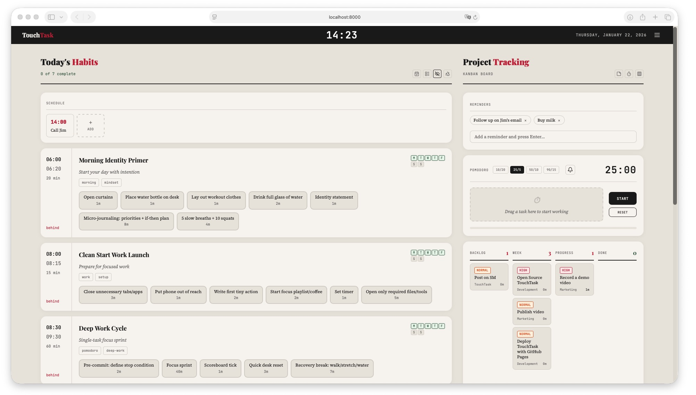

# TouchTask

A minimalist productivity app that helps you structure your day with time blocks, habits, and focused work sessions. TouchTask combines time blocking, habit tracking, pomodoro timing, and kanban task management into a single, elegant interface.


_The TouchTask dashboard showing the habits section on the left and project tracking on the right_

## About

TouchTask is a client-side web application that runs entirely in your browser, and can also be built as a native desktop application using Tauri. All your data is stored locally using localStorage—no account required, no server needed, your data stays on your machine.

**Key Features:**

- **Time Blocks:** Schedule recurring daily habits and routines
- **Pomodoro Timer:** Focus sessions with automatic time tracking
- **Kanban Board:** Manage projects through backlog, week, progress, and done columns
- **Daily Schedule:** Appointments and meetings for today
- **Reminders:** Quick sticky notes for things you need to remember

## Setup

### Prerequisites

**For Web Development:**

- Node.js 18+ and npm

**For Desktop App Development (Tauri):**

- Node.js 18+ and npm
- Rust toolchain (install via [rustup](https://rustup.rs/))
- Platform-specific build tools:
  - **Windows:** Microsoft C++ Build Tools
  - **macOS:** Xcode Command Line Tools (`xcode-select --install`)
  - **Linux:** `build-essential`, `libwebkit2gtk-4.0-dev` (Ubuntu 22.04) or `libwebkit2gtk-4.1-dev` (Ubuntu 24.04+), `libssl-dev`, `libgtk-3-dev`, `libayatana-appindicator3-dev`, `librsvg2-dev`

**Optional - Task Runner (`just`):**

The project includes a `justfile` for convenient command shortcuts. `just` is optional - all commands can be run directly with npm. To install `just`:

- **Via snap (Linux):** `sudo snap install just --classic`
- **Via cargo (if Rust is installed):** `cargo install just`
- **Or use npm commands directly** - see commands below

### Installation

```bash
# Clone the repository
git clone https://github.com/yourusername/touchtask.git
cd touchtask

# Install dependencies
cd frontend
npm install

# Start development server
npm run dev
```

The app will be available at `http://localhost:5173`

### Production Build

```bash
npm run build
```

The built files will be in the `dist` folder. These are static files that can be hosted anywhere or opened directly in a browser.

### Desktop App

TouchTask can be built as a native desktop application for Windows, macOS, and Linux using Tauri.

**First-time Setup:**

1. Install Rust toolchain (if not already installed):

   ```bash
   curl --proto '=https' --tlsv1.2 -sSf https://sh.rustup.rs | sh
   ```

2. Install Tauri dependencies:

   ```bash
   cd frontend
   npm install
   ```

3. Initialize Tauri (one-time setup):

   ```bash
   # Using just (if installed):
   just tauri-init

   # Or directly (handles CI environment variable automatically):
   cd frontend && unset CI && npx tauri init --app-name TouchTask --window-title TouchTask --frontend-dist ../../dist --dev-url http://localhost:8000 --before-dev-command "npm run dev" --before-build-command "npm run build"
   ```

   **Note:** If Tauri is already initialized (you see a `frontend/src-tauri/` directory), you can skip this step.

   **Note:** If you encounter an error about `--ci` flag, it's likely because the `CI` environment variable is set. The `just tauri-init` command handles this automatically. If running manually, use:

   ```bash
   cd frontend && unset CI && npx tauri init --app-name TouchTask --window-title TouchTask --frontend-dist ../../dist --dev-url http://localhost:8000 --before-dev-command "npm run dev" --before-build-command "npm run build"
   ```

   When prompted (if running interactively):
   - App name: `TouchTask`
   - Window title: `TouchTask`
   - Web assets location: `../../dist`
   - Dev server URL: `http://localhost:8000`
   - Frontend dev command: `npm run dev`
   - Frontend build command: `npm run build`

**Development:**

Run Tauri in development mode:

```bash
# Using just (run from project root):
cd ~/touchtask
just tauri-dev

# Or directly with npm:
cd frontend && npm run tauri:dev
```

**Note:** The `just` command is optional. All commands can be run directly with npm from the `frontend` directory. **Important:** Run `just` commands from the project root (`~/touchtask`), not from the `frontend` directory.

**Production Build:**

Build the desktop app:

```bash
# Using just (run from project root):
cd ~/touchtask
just tauri-build

# Or directly with npm:
cd frontend && npm run tauri:build
```

The built application will be in:

- **Debug build:** `frontend/src-tauri/target/debug/`
- **Release build:** `frontend/src-tauri/target/release/`

For more detailed Tauri setup instructions, see [docs/TAURI_SETUP.md](docs/TAURI_SETUP.md).

---

## Folder Structure

```
touchtask/
├── dist/                  # Production build output
│   ├── assets/            # Compiled JS/CSS bundles
│   └── index.html         # Entry point
├── docs/                  # Documentation
│   └── gfx/               # Screenshots and images
├── frontend/              # React application source
│   ├── public/            # Static assets
│   ├── src/               # Source code
│   │   ├── assets/        # Images, fonts, etc.
│   │   ├── App.jsx        # Main app component
│   │   └── main.jsx       # Entry point
│   └── src-tauri/         # Tauri Rust backend (created after tauri init)
│       ├── Cargo.toml     # Rust dependencies
│       ├── tauri.conf.json # Tauri configuration
│       └── src/           # Rust source code
├── .gitignore
├── .nvmrc                 # Node version
├── justfile               # Task runner commands
└── README.md
```

---

## Documentation

A video overview of the TouchTask UI and how to use its features:

[](https://www.youtube.com/watch?v=Bihlr5uGq8g)

For a text based user guide and tutorial, see [docs/TUTORIAL.md](docs/TUTORIAL.md).

---

## Troubleshooting

### Data disappeared after clearing browser data

TouchTask stores everything in localStorage. Clearing browser data, cookies, or site data will erase your TouchTask data. Use the Save feature regularly to create backups.

### Timer sound not playing

- Check that your browser tab isn't muted
- Ensure the bell icon in the pomodoro section is enabled (not crossed out)
- Some browsers block audio until you've interacted with the page

### Time blocks not showing

- Check if Focus Mode is enabled (eye icon in header)—it only shows blocks scheduled for today's day of week
- Check if Time Blocks visibility is toggled off (layout icon in header)

### Tasks not saving

- Ensure you have localStorage enabled in your browser
- Check if you're in private/incognito mode (localStorage may not persist)

### App looks broken or unstyled

- Try a hard refresh (Ctrl+Shift+R or Cmd+Shift+R)
- Clear browser cache and reload
- Ensure JavaScript is enabled

### Tauri Build Issues

**Rust not found:**

- Install Rust toolchain: `curl --proto '=https' --tlsv1.2 -sSf https://sh.rustup.rs | sh`
- Restart your terminal after installation
- Verify with: `rustc --version`

**"tauri init" fails with CI environment variable error:**

- If you see `error: invalid value '1' for '--ci'`, the `CI` environment variable is set
- The `just tauri-init` command handles this automatically
- If running manually, unset CI first: `unset CI && npx tauri init ...`
- Or use the non-interactive command with explicit flags (see Desktop App setup section)

**Platform-specific build errors:**

- **Windows:** Install Microsoft C++ Build Tools from [Visual Studio](https://visualstudio.microsoft.com/downloads/)
- **macOS:** Install Xcode Command Line Tools: `xcode-select --install`
- **Linux:** Install required packages:

  For Ubuntu 22.04 and earlier:

  ```bash
  sudo apt update
  sudo apt install libwebkit2gtk-4.0-dev \
    build-essential \
    curl \
    wget \
    libssl-dev \
    libgtk-3-dev \
    libayatana-appindicator3-dev \
    librsvg2-dev
  ```

  For Ubuntu 24.04 (Noble) and later:

  ```bash
  sudo apt update
  sudo apt install libwebkit2gtk-4.1-dev \
    build-essential \
    curl \
    wget \
    libssl-dev \
    libgtk-3-dev \
    libayatana-appindicator3-dev \
    librsvg2-dev
  ```

**Window not appearing or white screen:**

- Check that the web assets path in `frontend/src-tauri/tauri.conf.json` is correct (`../../dist`)
- Ensure you've run `npm run build` before `npm run tauri:build`
- Check the console for errors in the Tauri dev tools

**"You must change the bundle identifier" error:**

- The bundle identifier in `frontend/src-tauri/tauri.conf.json` must be changed from the default `com.tauri.dev`
- Change the `identifier` field to a unique value (e.g., `com.touchtask`)
- Use reverse domain notation (e.g., `com.yourname.touchtask`)
- **Note:** Avoid ending with `.app` on macOS as it conflicts with the application bundle extension

**Build takes too long:**

- First build compiles Rust dependencies and can take 10-20 minutes
- Subsequent builds are much faster
- Use `npm run tauri:dev` for faster development iteration

**"Permission denied" or "cargo: command not found" error:**

- Rust is installed but `cargo` is not in your PATH
- Source the Rust environment: `source ~/.cargo/env`
- Or add to your shell profile (`.bashrc` or `.zshrc`): `export PATH="$HOME/.cargo/bin:$PATH"`
- The `just tauri-build` and `just tauri-dev` commands automatically set the PATH
- If running npm directly, ensure cargo is in PATH first

**Build configuration:**

The build is configured to exclude AppImage (which has known issues with linuxdeploy) and only builds reliable package formats:

- **Linux:** `.deb` and `.rpm` packages (AppImage excluded)
- **Windows:** `.msi` installer (built automatically on Windows)
- **macOS:** `.dmg` and `.app` bundle (built automatically on macOS)

This ensures platform-independent builds that complete successfully without errors.

---

## Contributing

Contributions are welcome! Here's how to get started:

1. **Fork** the repository
2. **Create a branch** for your feature: `git checkout -b feature/amazing-feature`
3. **Make your changes** and test thoroughly
4. **Commit** with clear messages: `git commit -m "Add amazing feature"`
5. **Push** to your branch: `git push origin feature/amazing-feature`
6. **Open a Pull Request** with a description of your changes

### Development Guidelines

- Keep the minimalist aesthetic—avoid feature bloat
- Test in multiple browsers (Chrome, Firefox, Safari)
- Maintain the existing code style
- Update documentation for new features

### Reporting Issues

Found a bug? Please open an issue with:

- Clear description of the problem
- Steps to reproduce
- Expected vs actual behavior
- Browser and OS information

---

## License

MIT License

Copyright (c) 2025

Permission is hereby granted, free of charge, to any person obtaining a copy
of this software and associated documentation files (the "Software"), to deal
in the Software without restriction, including without limitation the rights
to use, copy, modify, merge, publish, distribute, sublicense, and/or sell
copies of the Software, and to permit persons to whom the Software is
furnished to do so, subject to the following conditions:

The above copyright notice and this permission notice shall be included in all
copies or substantial portions of the Software.

THE SOFTWARE IS PROVIDED "AS IS", WITHOUT WARRANTY OF ANY KIND, EXPRESS OR
IMPLIED, INCLUDING BUT NOT LIMITED TO THE WARRANTIES OF MERCHANTABILITY,
FITNESS FOR A PARTICULAR PURPOSE AND NONINFRINGEMENT. IN NO EVENT SHALL THE
AUTHORS OR COPYRIGHT HOLDERS BE LIABLE FOR ANY CLAIM, DAMAGES OR OTHER
LIABILITY, WHETHER IN AN ACTION OF CONTRACT, TORT OR OTHERWISE, ARISING FROM,
OUT OF OR IN CONNECTION WITH THE SOFTWARE OR THE USE OR OTHER DEALINGS IN THE
SOFTWARE.
